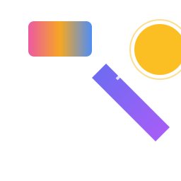

<div align="center">

<p align="center"></p>

# 🛠️ CodeForge AI

**The open-source, privacy-first alternative to expensive AI coding assistants.**  
*Local by default • 100% free forever • Beautiful modern UI*

[](LICENSE)
[](SECURITY.md)
[](CODE_OF_CONDUCT.md)
[]()
[]()
[](https://ollama.com)

**Status**: ✅ Week 1–2 shipped · 🚧 Week 3 in progress — persistent chat history  
**Target Launch**: Late October 2026

</div>  

---

## 🎯 What This Solves

AI coding assistants like Jev, Cursor, and GitHub Copilot cost $20–40/mo per seat and run your code through their cloud. CodeForge gives indie developers and privacy-conscious teams:

- ✅ **Free forever** — open-source MIT license
- ✅ **Local by default** — works fully offline via Ollama; your code never leaves your machine
- ✅ **Cloud optional** — bring your own API keys when you need bigger models
- ✅ **Code-aware chat** — upload files and get contextual analysis, debugging, and explanations
- ✅ **Beautiful UI** — modern React + Tailwind interface with streaming responses

Built because "open Jev alternative" threads keep trending on Hacker News — demand is proven, the tools aren't ready.

---

## ⚙️ Prerequisites

| Requirement | Version | Check |
|-------------|---------|-------|
| Python | 3.10+ | `python3 --version` |
| Node.js | 18+ | `node --version` |
| Ollama | latest | `ollama --version` |
| A local model | any | `ollama list` |

---

## 🚦 Quick Start (Time-to-First-Chat: ~3 minutes)

```bash
# 0. Pull a local model (one-time, ~5 min)
ollama pull qwen3.5        # or: llama3.2, mistral, deepseek-coder

# 1. Clone the repo
git clone git@github.com:YOUR-USERNAME/codeforge-ai.git
cd codeforge-ai

# 2. One-command setup + launch (installs deps, starts both servers)
python3 -m venv venv
source venv/bin/activate
pip install -r src/backend/requirements.txt
cd frontend && npm install && cd ..
./start.sh

# 3. Open the app
http://localhost:3000
```

### Manual start (if you prefer)

```bash
# Terminal 1 — Backend API on :8001
cd src/backend
uvicorn main:app --reload --port 8001

# Terminal 2 — Frontend on :3000
cd frontend
npm run dev
```

### First message

> "Explain how async/await works in JavaScript and show me a Python example."

Paste code, upload files (paperclip icon), or ask anything — everything runs locally.

---

## 📚 Documentation

| Doc | Purpose |
|-----|---------|
| [QUICKSTART](docs/QUICKSTART.md) | Fast setup, day-to-day usage |
| [Changelog](CHANGELOG.md) | What changed in each release |
| [Security Policy](SECURITY.md) | How to report vulnerabilities privately |
| [Code of Conduct](CODE_OF_CONDUCT.md) | Community standards |
| [Contributing](docs/CONTRIBUTING.md) | How to help + PR guidelines |

---

## 🔥 Features

### ✅ Core Chat (Week 1)
- Streaming responses over Server-Sent Events ("AI is typing...")
- Markdown rendering with **syntax-highlighted code blocks**
- **Copy button** on every code snippet
- Suggestion prompts, clear-chat, timestamps
- Dark/light theme, persisted in localStorage

### ✅ Code Awareness (Week 2)
- **Drag-and-drop file upload** — up to 10 files, selectable context
- AI analyzes your uploaded files when answering (file contents injected into the prompt)
- "Explain this code", "find the bug", "write tests" on your actual files

### ✅ Model Flexibility
- Local LLMs via Ollama — **zero cost, 100% private** (default)
- Auto-detects all installed local models at startup
- Switch models from the header without restart
- Cloud-ready architecture for BYO API keys (roadmap)

### ✅ Conversation History (Week 3)
- **Persistent chat history** — chats saved to local SQLite, restored on restart
- Sidebar of past conversations with one-click reopen
- **Export any chat** to Markdown or JSON
- Create / rename / delete chats from the UI

### 🚧 Roadmap
| Milestone | Feature |
|-----------|---------|
| Week 3 | ✅ Conversation history (SQLite, export, sidebar) — **in progress** |
| Week 4 | Vector embeddings + semantic search across files |
| Week 5 | Polish, docs, GitHub repo launch |
| v2+ | VS Code extension, team workspaces, self-hosted sync |

---

## 🛠️ Tech Stack

| Layer | Technology | Why |
|-------|------------|-----|
| **Frontend** | React 18 + TypeScript + Vite + Tailwind CSS | Fast dev loop, modern UI |
| **Markdown** | react-markdown + remark-gfm | Code blocks with copy buttons |
| **Backend** | Python FastAPI + Uvicorn | Async SSE streaming, easy LLM integration |
| **LLM runtime** | Ollama (local) | Your code never leaves your machine |
| **Storage** | In-memory → SQLite (Week 3+) | Local-first, easy to extend |

---

## 🧪 Running Tests

```bash
# Backend (FastAPI test endpoints)
curl http://localhost:8001/health          # → {"status":"healthy"}
curl http://localhost:8001/api/models      # → installed Ollama models
curl -X POST http://localhost:8001/api/chat \
  -H "Content-Type: application/json" \
  -d '{"message":"hello","stream":false}'

# Upload + retrieval
curl -X POST http://localhost:8001/api/upload -F "files=@main.py"
curl http://localhost:8001/api/files
```

Automated test suites are on the Week 4 plan (pytest + Vitest).

---

## 🔒 Privacy & Security

- **No telemetry, no analytics, no tracking** — there is nothing to opt out of
- Local mode makes zero network calls to any third party
- Uploaded files live in `/tmp` and are cleared on restart (SQLite persistence coming)
- Cloud providers require **your** API keys — we never store them server-side

---

## 🤝 Contributing

CodeForge is built and maintained by a small team — and we'd love more help to compete with the commercial alternatives. Here's how to contribute:

### For Non-Coders
- 🔴 **Report bugs**: Use GitHub Issues, include steps to reproduce
- 🟢 **Vote on roadmap**: Comment on issues that matter to you  
- 🟡 **Share the word**: Tweet about it, post on HN when we launch

### For Coders
1. Fork repo
2. Create feature branch (`git checkout -b feature/your-feature`)
3. Make changes, add tests if applicable  
4. Commit with meaningful messages
5. Push and open PR

**Priority Areas**:
- UI polish (design feedback)
- Model provider integrations beyond Ollama  
- Mobile-responsive versions
- Test coverage
- Documentation improvements

---

## 📊 Project Status

**Current: Week 1–2 complete, Week 3 in progress** — local chat + code awareness working end-to-end; chat persistence being wired.

| Week | Goal | Status |
|------|------|--------|
| 1 | Foundation + basic chat UI | ✅ Complete |
| 2 | Code awareness (file upload + context) | ✅ Complete |
| 3 | Conversation history (SQLite + export + sidebar) | 🟡 In progress |
| 4 | Semantic search + embeddings | ⚪ Pending |
| 5–6 | Beta launch on GitHub | ⚪ Pending |

---

## 🏷️ Why This Exists

Recent Hacker News trends show clear demand:

- **"OpenJev"** launched: 660 points, 277 comments
- **"Laya open source Jev alternative"**: #1 trending, 398 points
- Multiple discussions about expensive AI tools ($400/yr = out of reach for many)

**Our thesis**: Indie developers want privacy-respecting, free AI coding assistance. Existing open-source tools lack polish. We have the UI advantage.

---

## 📜 License

**MIT License** — see [LICENSE](LICENSE) file. Use it commercially, fork it, extend it.

CodeForge will remain **free and open source**. Sustainability (if needed) comes from:
- Optional self-hosted cloud sync add-ons
- Commercial enterprise hosting
- Donations via Open Collective

---

## 👥 Community

Join the conversation:
- 🐛 **Issues & Discussions**: on GitHub (enable repo Discussions at launch)
- 📧 **Email**: [Nofacetryharder@gmail.com](mailto:Nofacetryharder@gmail.com)
- 🐦 **Twitter/X**: to be announced

---

## ❤️ Acknowledgments

Inspired by discussions on Hacker News about affordable AI coding tools. Thanks to:
- Tabby community for open source hosting work
- Continue.dev for proving VS Code extensions can work  
- Every indie developer who's complained about $400/year pricing 😄

---

**Developed by the CodeForge AI team** — free for you, open to everyone.
